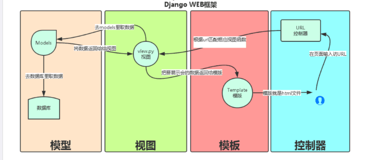

##认识Django
####1. Django简介
Django是一个用Python编写的开放源代码的Web应用框架，代码是开源的。此系统采用了MVC的框架模式, 也可以称为MTV模式。
<br>
####2.Django的模型简介
MVC全名是Model View Controller，是模型(model)－视图(view)－控制器(controller)的缩写，一种软件设计典范，用一种业务逻辑、数据、界面显示分离的方法组织代码，将业务逻辑聚集到一个部件里面，在改进和个性化定制界面及用户交互的同时，不需要重新编写业务逻辑。**严格的说Django的模型是MTV模式。**
Model:数据存取层，即模型对象负责在数据库中存储数据。
View: 表现层，负责业务逻辑适当调用Model和Template
Template:负责把页面渲染展示给用户

####3.创建Django项目
3.1 创建项目

	django-admin startproject work

该命令是创建一个名为work的工程

###### 项目目录介绍
下面展示创建以后的文件，具体有哪些文件：
**manage.py**： 是Django用于管理本项目的管理集工具，用于项目的启动运行。

**__init__.py**： 为初始化文件，指明该目录结构是一个python包。

**seetings.py**： Django项目的配置文件，其中定义了本项目的引用组件，项目名，数据库，静态资源，调试模式，域名限制等
	（1）设置创建的应用
	INSTALLED_APPS = [
	  'django.contrib.admin',
	  ......
	  'django.contrib.staticfiles',
	  'carts',
	  'goods',]
	  (2)中间件设置
	  MIDDLEWARE = [
	'django.middleware.security.SecurityMiddleware',
	......
	'django.contrib.messages.middleware.MessageMiddleware',
	'django.middleware.clickjacking.XFrameOptionsMiddleware',]
	(3)数据库设置
	DATABASES = {
	'default': {
	    'ENGINE': 'django.db.backends.mysql',
	    'NAME': ,
	    'USER': ,
	    'PASSWORD': ,
	    'HOST': , 
	    'PORT': ,
	}}
	（4）跨域请求设置
	跨域允许的请求方式，可以使用默认值，默认的请求方式为:
	CORS_ALLOW_METHODS = (
	'GET',
	'POST',
	'PUT',
	'PATCH',
	'DELETE',
	'OPTIONS',)
	# 允许跨域的请求头，可以使用默认值，默认的请求头为:
	CORS_ALLOW_HEADERS = default_headers
	CORS_ALLOW_HEADERS = (
	'XMLHttpRequest',
	'X_FILENAME',
	'accept-encoding',
	'authorization',
	'content-type',
	'dnt',
	'origin',
	'user-agent',
	'x-csrftoken',
	'x-requested-with',
	'Pragma',)
	# 跨域请求时，是否运行携带cookie，默认为False
	CORS_ALLOW_CREDENTIALS = True
	允许所有主机执行跨站点请求，默认为False
	# 如果没设置该参数，则必须设置白名单，运行部分白名单的主机才能执行跨站点请求
	CORS_ORIGIN_ALLOW_ALL = True
	（5）rest_framewok设置
	REST_FRAMEWORK = {
	# 响应结果重构配置
	'DEFAULT_RENDERER_CLASSES': (
	    'utils.myrenderer.MyJSONRenderer',),
	'DEFAULT_FILTER_BACKENDS':('django_filters.rest_framework.DjangoFilterBackend',)}

**urls.py**：项目的URL路由映射，也可实现路由分发响应。
	urlpatterns = [
	path('admin/', admin.site.urls),
	# 路由的分发
	path('api/user/', include('user.urls')),
	......]
**wsgi.py**：定义WSGI接口信息，通常本文件生成后无需改动

3.2 运行Django项目
```
python manage.py runserver 端口
```
该命令是运行项目，端口可以不用写，启动的时候会默认随机创建一个可以使用的端口

3.2 创建应用(app)
```
python manage.py startapp work_app
```
该命令创建一个名为work_app的app
